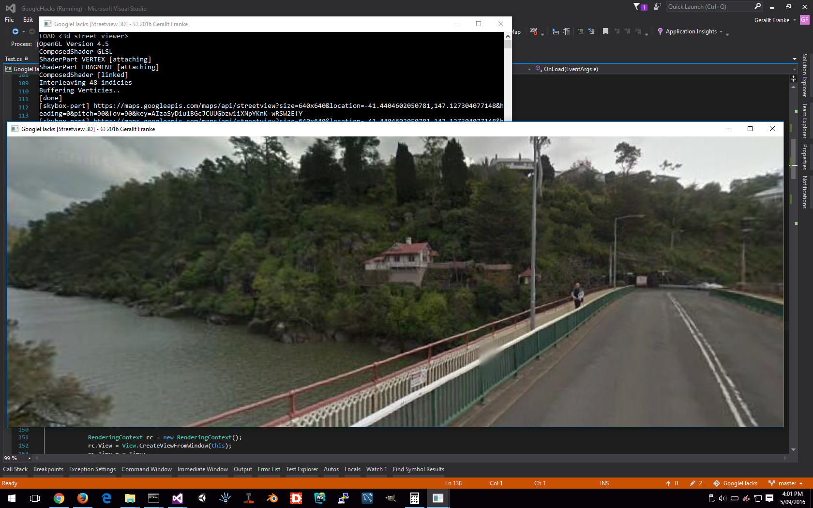

# GoogleHacks

This repository, GoogleHacks throws together a C# API for google maps specifically google street view, 
providing the means to integrate Street View with C#, OpenTK, OpenGL projects, 
with a bunch of new features inherent from a modern graphical library.  

The API within provides sampling input of 6 Skybox images (front, back, left, right, up, down)
mapping them to a skybox using the X3D Background node, outputting a 3D rendering; 360 degree panorama for the current camera position. 

The toolkit used is X3D-finely-sharpened built purely in C#.

* the quaternion based camera contained in the accompanying graphical library 
  is actually better than the google maps camera, as google street view suffers from gimbal lock.    

Project currently in development, more to be implemented.

Development tasks:
* [COMPLETED] Quaternion based camera coordinates as input to street view api; camera yaw, and pitch controls
* [COMPLETED] Camera position vector mapping to UV Spherical coordinate for translation of 3D space to geospacial
* [COMPLETED] Streetview provider
* [COMPLETED] 3D Application skeleton + integration with x3d-finely-sharpened
* TODO Visualize nearest roads in minimap depthmask-locked to top lefthand corner 
* TODO interpolate road paths for waypoint smoothing in minimap
* TODO Snap to nearest road using 'Snap to Roads' https://developers.google.com/maps/documentation/roads/snap
* TODO Image sitching of panorama
* TODO local caching of textures and preloading 
* TODO preference of local cache to under utilise google api throughput 
* TODO minimised api requests
* TODO processing of textures into 3D voxels and image delta compression

